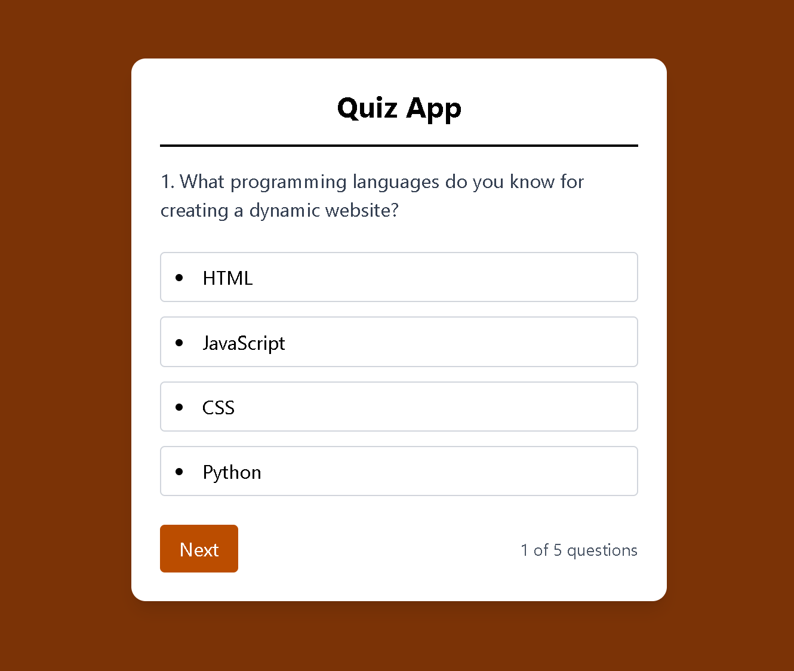

# React + Vite

This template provides a minimal setup to get React working in Vite with HMR and some ESLint rules.

Currently, two official plugins are available:

- [@vitejs/plugin-react](https://github.com/vitejs/vite-plugin-react/blob/main/packages/plugin-react) uses [Babel](https://babeljs.io/) for Fast Refresh
- [@vitejs/plugin-react-swc](https://github.com/vitejs/vite-plugin-react/blob/main/packages/plugin-react-swc) uses [SWC](https://swc.rs/) for Fast Refresh

## Expanding the ESLint configuration

If you are developing a production application, we recommend using TypeScript with type-aware lint rules enabled. Check out the [TS template](https://github.com/vitejs/vite/tree/main/packages/create-vite/template-react-ts) for information on how to integrate TypeScript and [`typescript-eslint`](https://typescript-eslint.io) in your project.

# React Quiz App

A simple quiz application built with React. This app presents multiple-choice questions one by one, allows users to select answers, and shows correct and incorrect responses with color highlights. It includes navigation to move through questions and alerts the user when the quiz is completed.

---

## Features

- Displays quiz questions with multiple choice answers
- Highlights correct answers in green and wrong selections in red
- Prevents changing answer after selection
- Navigates through questions with "Next" button
- Shows current question number and total questions
- Alerts when the quiz is finished and restarts

---

## Demo

